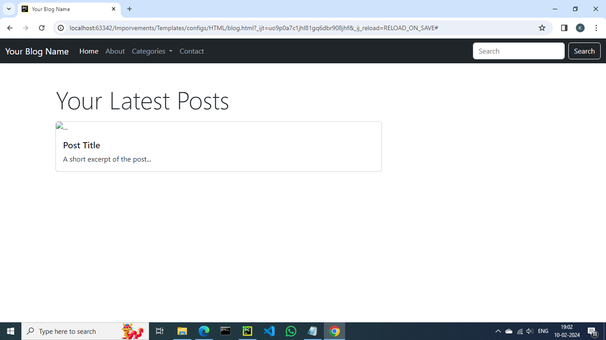
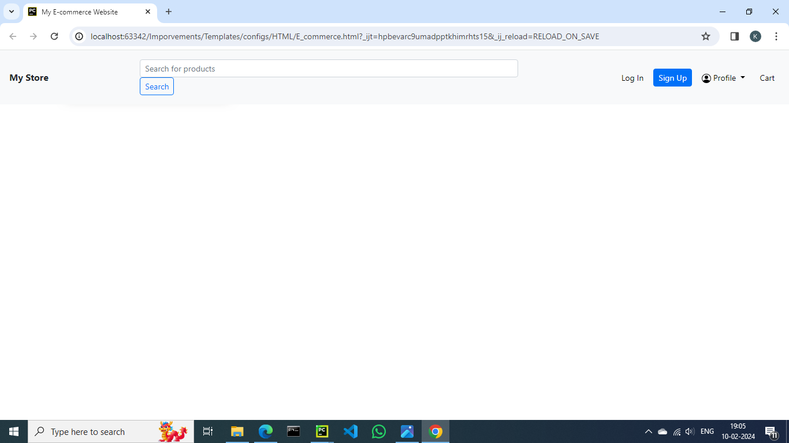
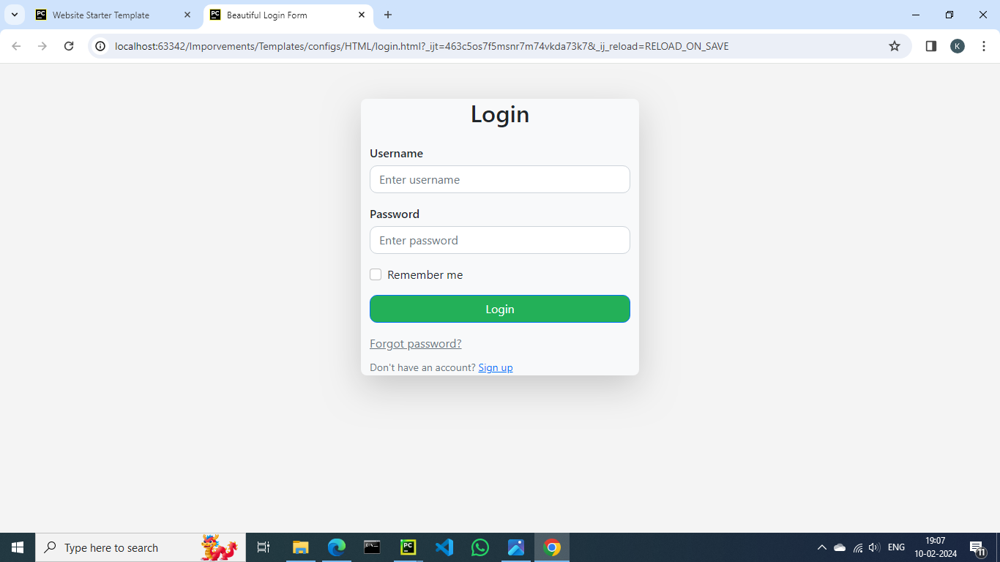
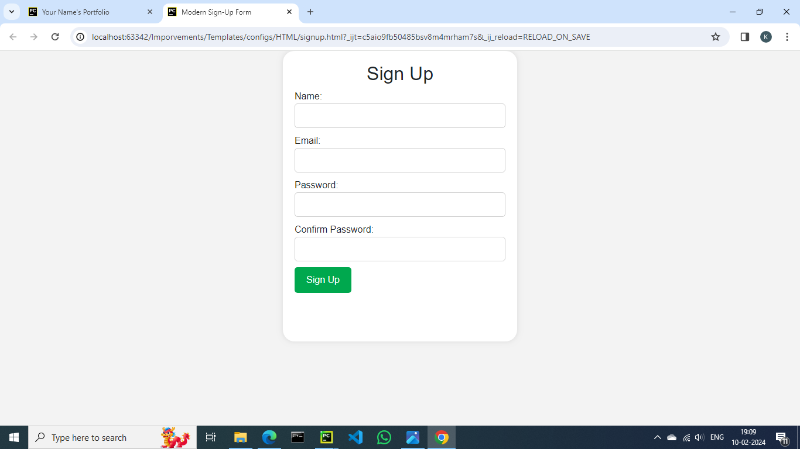

# Dev: Your AI-Powered Coding Assistant

Dev is a multi-purpose tool designed to streamline your coding workflow and leverage the power of large language models to enhance your productivity. It automates several common tasks and provides valuable insights through AI capabilities, making your coding experience smoother and more efficient.

# Table of Contents

- [Dev: Your AI-Powered Coding Assistant](https://github.com/GitCoder052023/Dev?tab=readme-ov-file#dev-your-ai-powered-coding-assistant)
- [Features of Dev](https://github.com/GitCoder052023/Dev?tab=readme-ov-file#features-of-dev)
- [Benefits of Dev](https://github.com/GitCoder052023/Dev?tab=readme-ov-file#benefits-of-dev)
- [Getting Started](https://github.com/GitCoder052023/Dev?tab=readme-ov-file#getting-started)
- [Developer](https://github.com/GitCoder052023/Dev?tab=readme-ov-file#deep-dive-in-dev)
  * [Debugger](https://github.com/GitCoder052023/Dev?tab=readme-ov-file#debugger)
  * [Readme Generator](https://github.com/GitCoder052023/Dev?tab=readme-ov-file#readme-generator)
  * [Upload git](https://github.com/GitCoder052023/Dev?tab=readme-ov-file#upload-git)
  * [Rename Github repo](https://github.com/GitCoder052023/Dev?tab=readme-ov-file#rename-github-repo)
  * [Generate](https://github.com/GitCoder052023/Dev?tab=readme-ov-file#generate)
  * [Review](https://github.com/GitCoder052023/Dev?tab=readme-ov-file#review)
  * [Generate Requirements.txt](https://github.com/GitCoder052023/Dev?tab=readme-ov-file#generate-requirements-files)
  * [Generate setup.py file](https://github.com/GitCoder052023/Dev?tab=readme-ov-file#generate-setup-files)
  * [Explain](https://github.com/GitCoder052023/Dev?tab=readme-ov-file#explain)
  * [Generate UI](https://github.com/GitCoder052023/Dev?tab=readme-ov-file#generate-ui)
  * [Modify](https://github.com/GitCoder052023/Dev?tab=readme-ov-file#modify)
  * [Translate code](https://github.com/GitCoder052023/Dev?tab=readme-ov-file#trans)
  * [Setup flask app](https://github.com/GitCoder052023/Dev?tab=readme-ov-file#setup-flask-app)
- [Managers](https://github.com/GitCoder052023/Dev?tab=readme-ov-file#managers)
  * [User_manager](https://github.com/GitCoder052023/Dev?tab=readme-ov-file#user_manager)
  * [Auth_manager](https://github.com/GitCoder052023/Dev?tab=readme-ov-file#auth_manager)


## Unique Features of Dev:

- AI-powered Debugging: Stuck on a coding bug? Dev can analyze your code with the help of a large language model, identify the error, and suggest corrections. Simply provide the error message or a specific prompt for tailored debugging assistance.

- Automated README Generation: Forget manually writing READMEs! Dev can automatically generate a comprehensive README file for your project, including descriptions, installation instructions, and other essential details.

- Creative Code Generation: Need a jumpstart on your code? Dev can generate code snippets based on your instructions, offering you creative and effective solutions to overcome coding challenges.

- In-depth Code Review: Unsure about your code's quality? Dev provides a detailed code review, highlighting potential improvements, optimizations, and areas for consideration. This valuable feedback can elevate your code to the next level.

- Seamless Git Integration: Dev simplifies project management by automating Git commands. You can easily create and upload repositories, rename existing ones, and push your code with just a few function calls.
  
- Tired of manually crafting requirements.txt and setup.py files for your Python projects? Dev takes care of these essential tasks with a few simple commands, saving you time and ensuring accuracy.

- Tired of manually crafting UI interfaces for your backend code? Dev takes care of the heavy lifting, effortlessly creating a matching user interface with integrated backend functionality.

- Seeking a comprehensive understanding of your code? Dev offers clear and insightful explanations, tailored to your preferred level of detail.

- Setup Flask App: The ```setup_flask_app()``` function empowers you to effortlessly create a basic Flask application with minimal setup. This function streamlines the initial configuration process, saving you time and effort when starting new web development projects using Flask.

## Benefits of Dev:

- Increased Productivity: Automate repetitive tasks like debugging and README generation, freeing up your time for more focused development.
- Improved Code Quality: Gain valuable insights from AI-powered debugging and code review, resulting in cleaner, more efficient code.
- Enhanced Creativity: Explore new possibilities with code generation, sparking innovation and overcoming coding hurdles.
- Streamlined Workflow: Integrate seamlessly with Git for effortless project management, allowing you to focus on what matters most - writing great code.

## Getting Started:
**Clone repo:**
1: clone repo
```bash
git clone https://github.com/GitCoder052023/Dev.git
```

2: Install the required libraries:

```Bash
pip install -r requirements.txt
```

3: Obtain a Google API key for Google Generative AI and set it as an environment variable:

Get your google gemini API key from [here](https://makersuite.google.com/app/apikey)
```Bash
export GOOGLE_API_KEY=YOUR_API_KEY
```

**Download package locally:**
```bash
pip install git+https://github.com/GitCoder052023/Dev.git
```

## Quick start
```python
from Dev.Developer import Dev

assistant = Dev.Dev("YOUR GOOGLE GEMINI API KEY")

assistant.generate("write a python code which can print 0 to 100")
```

Dev is your comprehensive coding companion. Whether you're a seasoned developer looking for a productivity boost or a beginner seeking guidance, Dev has something to offer. Embrace the power of AI and watch your coding workflow reach new heights of efficiency and effectiveness.

# Ongoing Developments
- **API Generator:** **(UNDER PLANNING)**

# Developer

## Debugger
Debugger provides a powerful tool for developers to streamline their debugging process. It is designed to automate the process of debugging code, making it more efficient and less time-consuming.

**Key Features:**

- Leverages Google's Gemini Pro language model for intelligent code analysis.
- Automatically retrieves code from the clipboard for seamless debugging.
- Generates potential fixes based on AI-powered insights.
- Automatically apply fixes within the code editor.


**Key Components:**

- **Debugger Class:** Encapsulates the debugging functionality.
- **debugger() Method:**
  - Retrieves code from the clipboard.
  - Utilizes GoogleGenerativeAI to generate potential fixes.
  - Applies fixes using PyAutoGUI.
- **remove_first_and_last_lines() Function:** Cleans up AI-generated code formatting.

## Usage

1. **Import the Debugger Class:**
  ```python
  from Dev.Developer import Dev
  ```

2. **Create a Debugger Instance with Your API Key:**
  ```python
  debugger = Dev.Dev(your-key)
  ```

3. **Initiate Debugging:**
  - **When an error occurs:**
   ```python
   debugger.Debugger(error) # Pass the error message as an argument
   ```
  - **To provide a specific prompt for guidance:**
   ```python
   debugger.Debugger(error, prompt="Add a comment explaining this line of code")
   ```

## Sample code
```python
from Dev.Developer import Dev
from key import key # please create a new python file "key" then paste your key inside their 

debugger = Dev.Dev(key) # you can directly paste your api key

try:
  def greet_user(name):
    print("Hello, " + uname + "!") # Typo: uname instead of name

  greet_user("Alice")

except Exception as e:
  debugger.Debugger(e)
```

## README Generator
The README Generator empowers you to effortlessly create detailed and informative READMEs for your projects. Forget spending time manually crafting these essential documents – this feature does the heavy lifting for you.

**Usage:**

1: Import the Dev Class:

```Python
from Dev.Developer import Dev
```

```Python
dev = Dev(your-key)
```

```Python
dev.generate_readme()
```

```Python
from Dev.Developer import Dev
from key import key

dev = Dev.Dev(key)

dev.generate_readme()

print("Your README is generated! Check out the 'README.md' file.")
```

## Upload Git:

This functionality simplifies Git repository management by automating commands

**Usage:**

1: Import the Dev Class:

```Python
from Dev.Developer import Dev
```

```Python
dev = Dev(your-key)
```

2: Upload your code to a new repository:

```Python
dev.upload_git("your-git-username", "your-repository-name")
```

**Sample Code:**

```Python
from Dev.Developer import Dev
from key import key

dev = Dev.Dev(key)

dev.upload_git("Bard-Dev", "my-awesome-project")

print("Your code is uploaded to your GitHub repository!")
```

## Rename GitHub Repo:

This feature allows you to easily rename your existing GitHub repository directly from your code editor.

**Usage:**

1: Import the Dev Class:

```Python
from Dev.Developer import Dev
```

2: Create a Dev Instance:

```Python
dev = Dev.Dev(your-key)
```

3: Rename your repository:

```Python
dev.rename_github_repo("old-repo-name", "new-repo-name")
```

**Sample Code:**

```Python
from Dev.Developer import Dev
from key import key

dev = Dev.Dev(key)

dev.rename_github_repo("my-old-repo", "my-new-repo)
```

## Generate:

This functionality leverages the language model to generate code based on your instructions or prompts.

**Usage:**

1: Import the Dev Class:

```Python
from Dev.Developer import Dev
```

2: reate a Dev Instance:

```Python
dev = Dev.Dev(your-key)
```

3: Generate code based on a prompt:

```Python
dev.generate("create a python code to print 0 to 100")
```

## Review
The Review function provides valuable insights into your code, helping you refine its quality and identify potential areas for improvement.

**Usage:**

1: Import the Dev Class:

```Python
from Dev.Developer import Dev
```

2: Create a Dev Instance:

```Python
dev = Dev(your-key)
```

3: Run the Review:

```Python
dev.review()
```

**Output:**

The review report will be saved to a file named "review.txt". This file will contain detailed feedback on your code, including:

- Potential improvements: Suggestions for optimizing code structure, performance, and readability.
- Alternative approaches: Different ways to achieve the same functionality, potentially offering advantages in specific situations.
- Warnings and errors: Identification of potential bugs, code smells, and best practices violations.
- Overall comments: General observations and recommendations for enhancing your code.

**Sample Code:**

```Python
from Dev.Developer import Dev
from key import key

dev = Dev.Dev(key)

dev.review()

print("Your code review is saved in 'review.txt'!")
```

## Generate Requirements Files:

**Key Features:**

- Automatically analyzes your code to identify required dependencies.
- Creates a comprehensive requirements.txt file listing those dependencies.
- Ensures compatibility and reproducibility for project setup.

**Usage:**

```Python
dev.generate_requirements()
```

**Output:**
A requirements.txt file is generated in your project directory, ready for use.

## Generate Setup Files:

**Key Features:**

- Automates the creation of setup.py files for Python projects.
- Streamlines the packaging and distribution process.
- Simplifies installation for others who want to use your project.

**Usage:**

```Python
dev.generate_setup()
```

**Output:**
A setup.py file is generated in your project directory, ready for deployment.

## Explain:

**Key Features:**
- Code Analysis: Thoroughly examines your code to grasp its purpose and functionality.
- Customized Explanations: Provides explanations in either detail or summary mode, adapting to your specific needs.
- Clear Documentation: Generates a text file containing the explanation, allowing for easy reference and sharing.

**Usage:**

1: Import the Dev Class:

```Python
from Dev.Developer import Dev
```

2: Create a Dev Instance:

```Python
dev = Dev.Dev(your-key)
```

```Python
dev.Explain(mode="detail")  # For a detailed explanation
dev.Explain(mode="summary")  # For a concise summary
```

**Output:**

A new explanation.txt file containing the generated explanation will be created.
Open the file to delve into the depths of your code's functionality.


## Generate UI:

**Key Features:**
- Automatic Code Analysis: Intelligently examines your backend code to understand its structure and logic.
- UI Generation with CSS: Seamlessly produces a corresponding HTML file with integrated CSS, ensuring a visually appealing and well-formatted interface.
- Backend Integration: Cleverly connects the generated UI with your backend code, ensuring seamless communication and functionality.

**Usage:**

1: Import the Dev Class:

```Python
from Dev.Developer import Dev
```

2: Create a Dev Instance:

```Python
dev = Dev.Dev(your-key)
```

3: Generate the UI:

```Python
dev.Generate_UI()
```

**Output:**

A new index.html file containing the generated UI with inline CSS will be created.
The file will automatically open in your default browser for immediate preview.

---
# Beta Functions

## Modify:
This functionality empowers you to directly modify your code within your code editor, leveraging the power of large language models for enhanced efficiency and quality.

**Key Features:**

- Prompted Code Modification: Provide specific instructions or ask questions about your code, and the AI will suggest modifications directly within your editor.
- Code Understanding: The language model analyzes the context and structure of your code, ensuring modifications are relevant and maintain functionality.
- Automatic Formatting: Preserves the original code formatting while applying changes, maintaining code readability.

**How it Works:**

- Provide a prompt: Type your desired changes or questions in the Dev interface.
- AI analyzes and suggests: Dev utilizes Google's Gemini Pro language model to generate modifications.
- Code is updated: The modified code is automatically inserted into your editor, replacing the original selection.
- Formatting retained: The code retains its original formatting for a seamless transition.

**Benefits:**

- Save time: Quickly iterate and experiment with code modifications without manual editing.
- Improve code quality: Gain valuable insights and suggestions for cleaner, more efficient code.
- Boost creativity: Explore new possibilities and approaches with AI-powered guidance.

**Example Usage:**

Prompt: "Make this function more efficient by using a list comprehension."

**Original Code:**
```python
def calculate_sum(numbers):
  total = 0
  for num in numbers:
    total += num
  return total
```

**Modified code**
```python
def calculate_sum(numbers):
  return sum(numbers)
```

## Trans:

This feature allows you to effortlessly translate your code into different programming languages, powered by the intelligence of large language models.

**Key Features:**

- Supports multiple languages: Translate your code between various languages, including Java, JavaScript, C, C++.
- Preserves code functionality: The translation process aims to maintain the original code's functionality and behavior.
- Clear and concise output: The translated code is saved in new file.

**How it Works:**

- Choose the target language: Specify the language you want to translate the code into.
- Initiate translation: Trigger the Dev trans function.
- AI analyzes and translates: Dev utilizes Google's Gemini Pro language model to understand and translate the code.
- Translated code generated: The translated code is displayed in the Dev interface or saved to a specified file.

**Benefits:**

- Effortless code reuse: Adapt your code to different environments and projects with ease.
- Explore new languages: Experiment with different languages without manual translation effort.
- Boost productivity: Save time and resources by automating code translation.

**Example Usage:**

**Original Code (Python):**

```Python
def greet_user(name):
  print(f"Hello, {name}!")
```

**Target Language: Java**

**Translated Code:**

```Java
public class Main {

  public static void main(String[] args) {
    String name = "Alice";
    System.out.println("Hello, " + name + "!");
  }
}
```

## Setup Flask App

**Key Features:**

- Generates essential Flask application code, including routing and a basic response.
- Creates necessary directories ```static``` and ```templates``` for further customization.
- Writes the Flask app code to a designated Python file ```app.py```
- Creates a default HTML template file ```index.html``` with a simple structure.

**Benefits:**

- Quickstart Development: Get your Flask project up and running in no time, focusing on core functionalities instead of boilerplate code.
- Organized Structure: Ensures proper directory and file organization for maintainable and scalable projects.
- Customization Ready: Provides a solid foundation for further development and personalization of your Flask application.

  **Usage:**

  1: Import the Dev Class:
  ```python
  from Dev.Developer import Dev
  ```

  2: Create a Dev Instance:
  ```python
  dev = Dev.Dev(your_api_key)
  ```

  3: Set up your Flask app:
  ```python
  dev.setup_flask_app()
  ```

  **Output:**
  The function will create the necessary files and directories in your current working directory, allowing you to start building your Flask application right away.

# Managers
  
# User_manager

**Introduction:**

This feature simplifies interacting with MongoDB databases, providing convenient methods for creating, reading, updating, and deleting data. With DB_manager, you can manage your MongoDB operations efficiently and effortlessly.

**Key Features**
- Connect to Databases: Establish connections using connection strings.
- CRUD Operations:
  * Create: Insert single or multiple documents.
  * Read: Find documents based on queries or retrieve all documents.
  * Update: Modify documents matching specific criteria.
  * Delete: Remove documents matching a query.
- Bulk Operations: Perform efficient insertions, updates, and deletions on multiple documents.
- Database and Collection Management: Create, access, and delete databases and collections.

**Key Components:**
- connect() Method: Establishes a connection to the specified database.
- create() Method: Inserts a single document into the collection.
- read() Method: Retrieves documents based on a query or all documents.
- update() Method: Updates documents matching a specific query.
- delete() Method: Removes documents matching a specific query.
- create_bulk() Method: Inserts multiple documents efficiently.
- update_bulk() Method: Updates multiple documents matching a query.
- delete_bulk() Method: Deletes multiple documents matching a query.
- create_database() Method: Creates a new database and collection.
- create_collection() Method: Creates a new collection within an existing database.
- delete_collection() Method: Removes a collection from the database.

## Usage:

1: Import the User_manager Class:
```python
from Dev.Managers import User_manager
```

2: Create an instance:
```python
db_manager = User_manager.DB_manager("mongodb://localhost:27017", "Your Database name", "Your collection name")
```

3: Interact with your database:
```python
# Insert a document
data = {"name": "John Doe", "age": 30}
db_manager.create(data)

# Find all documents with age greater than 25
results = db_manager.read({"age": 30})

# Update documents with age 30 and set their city to "New York"
db_manager.update({"age": 30}, {"city": "New York"}}) # Dev can handle dollar complication, you just need to give new data

# Delete all documents with age 30
db_manager.delete({"age": 30})

# Create a new database and collection
db_manager.create_database("my_new_database", "my_new_collection")

# Insert multiple documents at once
documents = [{"name": "Alice"}, {"name": "Bob"}]
db_manager.create_bulk(documents)
```

# Auth_manager

**Introduction:**

Auth_manager empowers you to easily implement user authentication and management functionalities in your Python applications. With its built-in security features, Auth_manager streamlines user registration, login, and profile management.

**Key Features**
- User Registration: Create new user accounts with usernames and passwords.
- User Deletion: Remove user accounts from the system.
- Password Updates: Allow users to change their passwords securely.
- Authentication: Verify user credentials for secure access control.
- User Details Retrieval: Access specific user information for various purposes.

**Key Components:**
- register_user() Method: Add a new user to the system.
- delete_user() Method: Remove a user from the database.
- update_user() Method: Enable users to update their passwords.
- authenticate_user() Method: Verify user credentials for login attempts.
- fetch_user_details() Method: Retrieve specific information about a user.

## Usage:

1: Import the DevAuth Class:
 ```python
from Dev.Managers import Auth_manager
```

2: Create an instance:
```python
auth_manager = Auth_manager.DevAuth("mongodb://localhost:27017", "Your Database name", "Your collection name")
```

3: Manage user accounts:
```python
# Register a new user
auth_manager.register_user("john_doe", "password123")

# Explore more!
```
---

# Templates
## Introduction

**Dev's Templates** provides a streamlined starting point for Python developers to create their websites using pre-built templates. Whether you're a beginner unsure of where to begin or an experienced developer seeking a quick setup, Dev's Templates offers a beautiful dashboard and various templates to kickstart your web development journey.

Key features include:

- **Built-in Templates**: Dev's Templates includes ready-to-use templates for landing pages, navigation bars, and more.
- **Dashboard Options**: Choose from different dashboards tailored for various website types:
    - General websites
    - E-commerce websites
    - Blog websites
    - Portfolio websites
- **Login and Signup Pages**: Dev also offers built-in login and signup pages for seamless user authentication.

Get started with Dev's Templates and accelerate your web development process! 🚀

## Quick start

```python
import Dev.Templates.setup_templates as ds

temps = ds.fetch_configs()  # for fetching list of html files from config
print(temps)

# You can use these templates in your flask app
ds.get_configs("blog.html")
ds.get_configs("E_commerce.html")
ds.get_configs("general.html")
ds.get_configs("login.html")
ds.get_configs("portfolio.html")
ds.get_configs("signup.html")
```

## Samples
### blog template


### E_commerce template


### General Website Template


### login page template


### Portfolio website template


### signup page template

